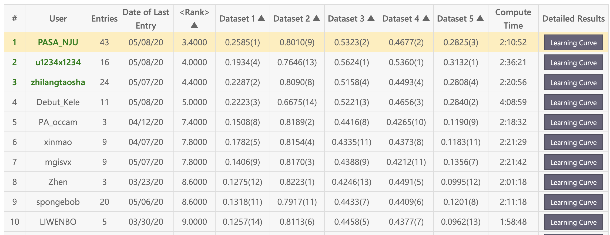
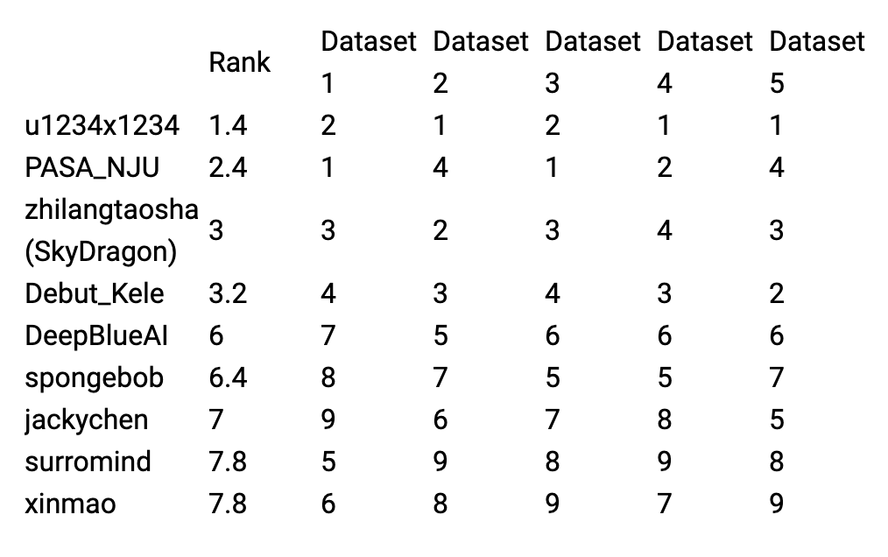

[](https://github.com/HazzaCheng/AutoSpeech2020/blob/master/LICENSE)

# AutoSpeech2020

## Introduction

PASA\_NJU's '2nd solution for [AutoSpeech 2020](https://www.4paradigm.com/competition/autospeech2020). **InterSpeech 2020** will be held in Shanghai, China from September 14 to 18, 2020. AutoSpeech 2020 is one of the competitions in main conference provided by 4Paradigm, ChaLearn, Southern University of Science and Technology, Northwestern Polytechnical University and Google.. The challenge website is [here](https://www.automl.ai/competitions/2). You can find public datasets and instructions for getting started.  And it's also a challenge of [AutoDL challenges series](https://autodl.chalearn.org/).

In this challenge, we further propose the Automated Speech (AutoSpeech) competition which aims at proposing automated solutions for speech-related tasks. This challenge is restricted to multi-label classification problems, which come from different speech classification domains. The provided solutions are expected to discover various kinds of paralinguistic speech attribute information, such as speaker, language, emotion, etc, when only raw data (speech features) and meta information are provided. There are two kinds of datasets, which correspond to public and private leaderboard respectively. Five public datasets (without labels in the testing part) are provided to the participants for developing AutoSpeech solutions. Afterward, solutions will be evaluated on private datasets without human intervention. The results of these private datasets determine the final ranking.

## Results

- Feedback-phase leaderboard


- Final-phase leaderboard


## Usage

Run

```
python run_local_test.py -dataset_dir=./sample_data/DEMO -code_dir=./code_submission
```

You can change the argument `dataset_dir` to other datasets, and change the argument `code_dir` to the directory containing this code (`model.py`).

## Contact Us

HazzaCheng: [hazzacheng@gmail.com](mailto:hazzacheng@gmail.com)
